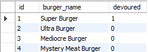

# burger

## Description

Burger is a CRUD app that gets a list of burgers from a MySQL DB, posts new burgers when the user types in a name and clicks submit, updates a burger's status to devoured when the user clicks "EAT!", and deletes a table row when the user clicks "CLEAN UP!" It does these commands by using Express, Express-Handlebars, Handlebars, MySQL, Bootstrap, and jQuery.

## MySQL DB

The database used can either be a local version of MySQL workbench using the provided schema, or JawsDB's integration on the Heroku App. Either way, the initial table looked like this.

## Website Sections

### Available Burgers and Devoured Burgers

Burgers on the left side are available to eat. When the user clicks "EAT!", they are moved to the right side where they may be cleaned up, meaning removed from the MySQL table.

### Add a Burger

Users may enter a burger name to insert it into the table, awaiting devouring.
